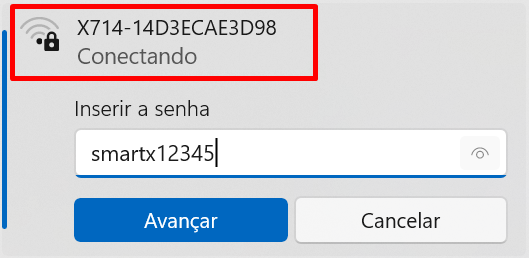
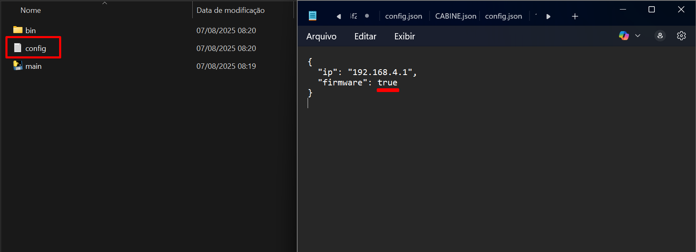
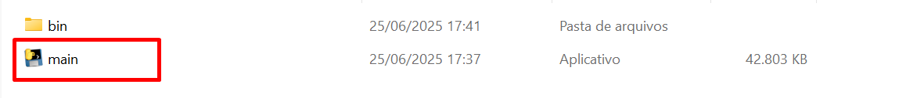
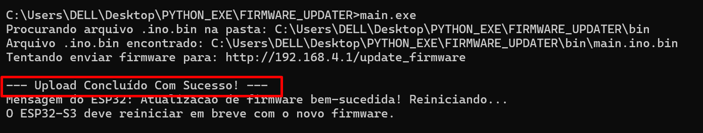
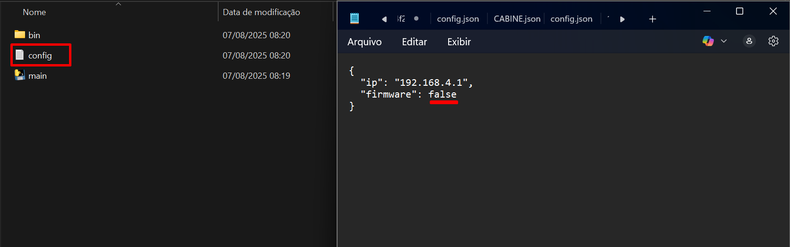

# 📦 Upload de Firmware – Passo a Passo

1. **Conectar ao wifi do pad**  
   

2. **Definir True no arquivo de config**
   

3. **Rodar o arquivo main**  
   

4. **Sucesso**  
   

5. **Repetir o processo com False no config**
   
